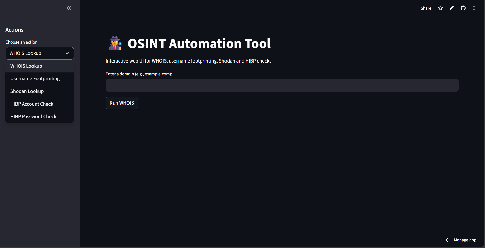
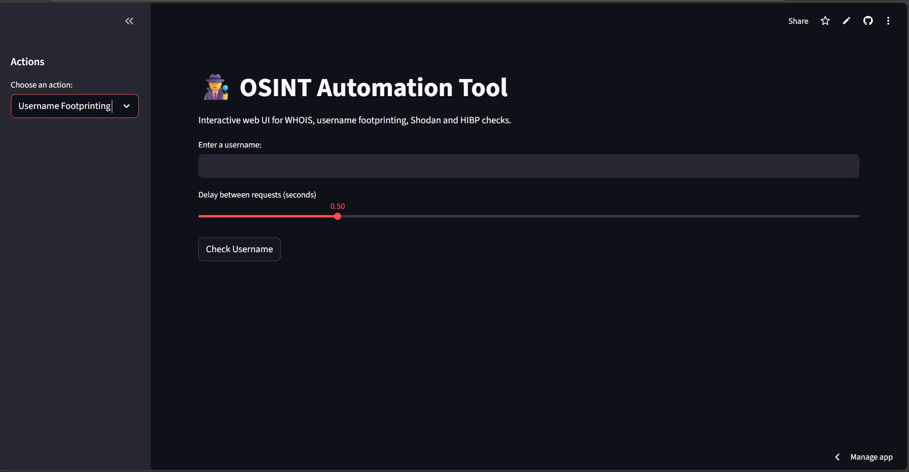
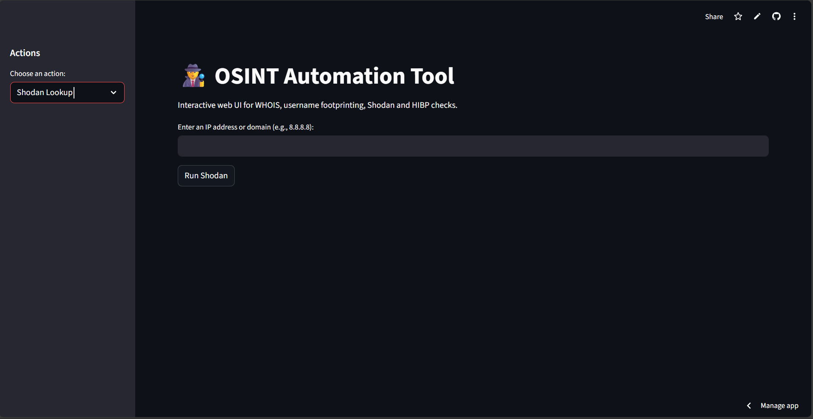

# 🕵️ OSINT Automation Tool

[](https://www.python.org/)  
[](https://streamlit.io/)  
[](LICENSE)

An **Open-Source Intelligence (OSINT) Automation Tool** built with **Python** and **Streamlit**.  
It provides a simple CLI and a clean web interface for domain, username, Shodan, and data breach checks.  

---

## 🚀 Live Demo
👉 Try it here: [OSINT Tool on Streamlit](https://osint-tool-sark-man.streamlit.app/)

---

## 📸 Screenshots

- **WHOIS Lookup**
  

- **Username Footprinting**
  

- **Shodan**
  

---

## ✨ Features
- 🔎 **WHOIS Lookup** for domains  
- 👤 **Username Footprinting** across:
  - GitHub
  - Twitter
  - Instagram
  - LinkedIn
  - Snapchat
  - TikTok
- 🌐 **Shodan Lookup** (IP/Domain information — requires API key)  
- 🔐 **Have I Been Pwned (HIBP)** checks:
  - Password (free k-anonymity API)
  - Account/email (paid API key)  
- 📤 **Export results** (CSV/JSON)  
- 🖥 **Dual interface**: CLI and Streamlit web app  

---

## ⚙️ Installation

### 1. Clone the repository
```bash
git clone https://github.com/Sark-man/osint-tool.git
cd osint-tool
```

### 2. Create virtual environment
```bash
python -m venv venv
venv\Scripts\activate   # on Windows
source venv/bin/activate  # on Mac/Linux
```

### 3. Install dependencies
```bash
pip install -r requirements.txt
```

### 4. Run the CLI
```bash
python src/main.py --domain example.com
python src/main.py --username johndoe
python src/main.py --shodan 8.8.8.8
python src/main.py --hibp-password password123
```

### 5. Run the Streamlit app
```bash
streamlit run streamlit_app.py
```

---

## 🔑 API Keys
Some features require API keys:

- **Shodan**: https://account.shodan.io/register  
- **Have I Been Pwned (HIBP)**: https://haveibeenpwned.com/API/Key  

On Streamlit Cloud → use **Secrets Manager**  
```toml
SHODAN_API_KEY = "your_shodan_key"
HIBP_API_KEY = "your_hibp_key"
```

Locally → set environment variables
```powershell
$env:SHODAN_API_KEY="your_shodan_key"
$env:HIBP_API_KEY="your_hibp_key"
```

---

## ⚠️ Disclaimer
This project is for **educational and defensive security purposes only**.  
Do not use it to target domains or accounts without permission.  
The author is not responsible for misuse.  

---

## 👨‍💻 Author
Developed by **[Sark-man](https://github.com/Sark-man)**
